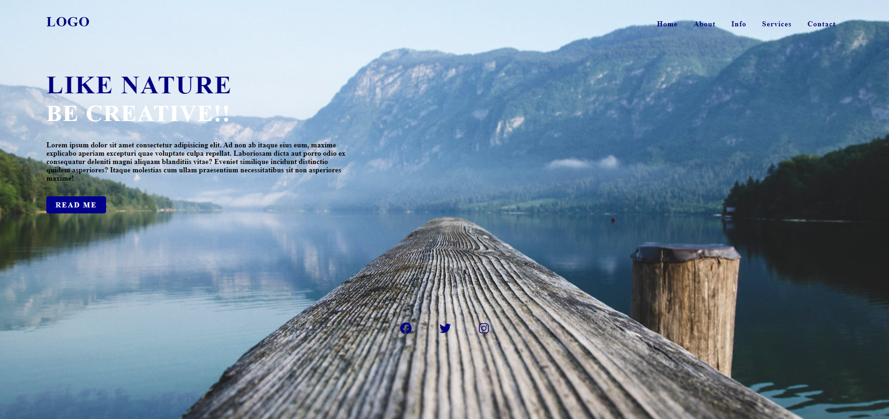

# landing-page02
## Description

A responsive landing page using just html and css. Build this landing page to keep on improving my skills as a web developer

## Installation

N/A

## Usage

Provide instructions and examples for use. Include screenshots as needed.

To add a screenshot, create an `assets/images` folder in your repository and upload your screenshot to it. Then, using the relative file path, add it to your README using the following syntax:

## Credits

Franco Folgarait(ME) - https://github.com/frankiebelize.

## License
MIT License

## Deployed Link
https://frankiebelize.github.io/landing-page02/

## Future Developments

Will add pages for about, services, info and contact.